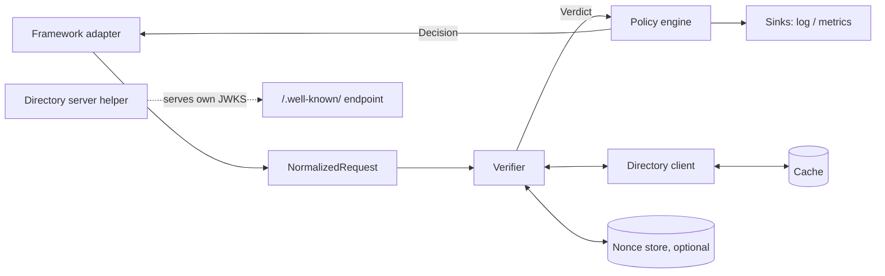

# Badge — Architecture

> Badge tells you who is knocking, and why you let them in.

Badge is middleware. It inspects an incoming HTTP request, decides whether the caller is a
**verified** agent, a **claimed** one, or **unknown**, applies an operator-authored policy, and
emits a structured record of exactly why it decided that.

Status: pre-v0. All five v0 components described below are implemented and tested; nothing is
published to npm. This is the contract the code is written against; where code and this file
disagree, one of them is a bug. `examples/demo.mjs` runs the whole path end to end.

---

## 1. Position

Cloudflare and Akamai verify Web Bot Auth signatures at the edge today. Everyone not behind a large
CDN has nothing. Badge is the in-process version of that check, for the origin server.

Design center: an operator installs Badge on a live site on a Tuesday afternoon and nothing breaks.
Every default is chosen to make that true — which is why the default policy is `log-only` and why
Badge never fails closed on its own network errors.

## 2. Non-goals

Badge is **not**:

- a bot _detector_ — no fingerprinting, no heuristics, no behavioural scoring. Badge only reads
  cryptographic claims the caller volunteered.
- a WAF, a rate limiter, or a payments layer (HTTP 402 / RSL / crawler pricing are out of scope).
- a reputation service. Badge does not ship a list of "good" agents (see §3).
- an authorization system for humans. It has no notion of sessions, users, or cookies.

## 3. Trust model — what "verified" actually means

**`verified` means: the caller controls a private key whose public half is published at the origin
named in its `Signature-Agent` header.** That is all it means.

It does _not_ mean the caller is well-behaved, that it respects `robots.txt`, or that the origin it
names is a company you have heard of. Anyone can stand up a directory and sign requests. Web Bot
Auth is an _identity_ layer, not a _trust_ layer.

Consequences that shape the whole design:

- The map from `signature-agent` origin → operator name is **operator-configured data**, not
  built-in knowledge. Badge ships no bundled allowlist in v0. A community-maintained, versioned map
  can ship later as a separate, optional package — never as a hidden default.
- Policy therefore keys on _origins_, with human-readable operator labels as sugar over them.

### Threat model

| Attacker can                                                | Badge response                                               |
| ----------------------------------------------------------- | ------------------------------------------------------------ |
| Forge `User-Agent`, invent any header                       | Ignored; only the signature counts                           |
| Point `Signature-Agent` at any URL, including internal ones | SSRF guard, §9                                               |
| Replay a captured, still-valid signature                    | Bounded by `expires`; optional nonce store (§8.4)            |
| Flood requests naming thousands of distinct origins         | Fetch caps, negative cache, circuit breakers (§9)            |
| Sign correctly and then behave badly                        | **Out of scope.** Badge tells you who it was                 |
| Compromise a legitimate operator's signing key              | **Out of scope.** Mitigated only by that operator's rotation |

## 4. Standards baseline

Badge implements, and invents nothing beyond:

| Spec                                                                                                 | Role                                                                                |
| ---------------------------------------------------------------------------------------------------- | ----------------------------------------------------------------------------------- |
| RFC 9421                                                                                             | HTTP Message Signatures — signature base construction, verification                 |
| RFC 9651                                                                                             | Structured Field Values — parsing `Signature-Input`, `Signature`, `Signature-Agent` |
| RFC 7638                                                                                             | JWK Thumbprint — the `keyid` is the thumbprint of the JWK                           |
| RFC 7517 / 7518                                                                                      | JWK / JWKS — directory payload shape                                                |
| `draft-meunier-web-bot-auth-architecture`                                                            | Architecture and terminology                                                        |
| `draft-meunier-webbotauth-httpsig-protocol`                                                          | Wire protocol: fields, tag, covered components                                      |
| `draft-meunier-webbotauth-httpsig-directory` (was `draft-meunier-http-message-signatures-directory`) | Key directory format and well-known URI                                             |
| `draft-meunier-webbotauth-registry`                                                                  | Registry / Signature Agent card — tracked, not implemented in v0                    |

**These drafts are not working-group adopted and they move — the directory draft has already been
renamed once.** See §18 for how Badge absorbs that without breaking installs.

A signed request carries three fields:

```http
Signature-Agent: "https://agent.example"
Signature-Input: sig1=("@authority" "signature-agent");created=1735689600
                 ;expires=1735689660;keyid="poqkLGiymh_W0uP6PZFw-dvez3QJT5SolqXBCW38r0U"
                 ;alg="ed25519";tag="web-bot-auth"
Signature: sig1=:base64signature:
```

Minimum covered components are `@authority` and, when the header is present, `signature-agent`.
Signature algorithm for v0 is `ed25519` only. The directory lives at
`https://<origin>/.well-known/http-message-signatures-directory` and is a JWKS served as
`application/http-message-signatures-directory+json`.

## 5. Component map



Five v0 deliverables map onto that picture:

1. **Verifier** — verdict plus a structured reason, always, including on failure.
2. **Policy engine** — verdicts and origins to `allow` / `deny` / `log-only`, per route.
3. **Adapters** — framework-agnostic core, thin per-framework shims.
4. **Directory helper** — serve your own `/.well-known/http-message-signatures-directory`.
5. **Observability** — the decision record, and dry-run mode. _(Provisional: see §19.)_

### Language

**v0 core is TypeScript**, targeting Node 20+, Deno, Bun, and Workers on one WebCrypto-based
Ed25519 path. The audience that lacks edge verification is disproportionately Node app servers, and
a library embeds where a proxy cannot.

The honest counterargument: a Go reverse-proxy sidecar would serve Python, Ruby, PHP, and Java
shops on day one, and those are a large slice of "not behind a CDN". The mitigation is structural —
the core is a pure function over a `NormalizedRequest` with injected I/O, so a Go port is a
re-implementation of §7 and §8 against shared test vectors, not a rewrite of tangled code. A
sidecar is the first thing to build after v0 (§19).

## 6. Request path

Ordered, and short-circuiting early on purpose — the overwhelming majority of production traffic
carries no Web Bot Auth fields and must not pay for the machinery.

1. **Presence test.** No `Signature-Input` and no `Signature-Agent` → `unknown` /
   `no_signature_fields`. Zero allocations, no parsing. Straight to policy.
2. **Parse** `Signature-Input`, `Signature`, `Signature-Agent` as RFC 9651 structured fields.
3. **Select** the signature: the first entry whose parameters carry `tag="web-bot-auth"`. Other
   signatures on the message are ignored, not errors.
4. **Preflight**, in this order, cheapest and most attributable first: covered components include
   `@authority` (and `signature-agent` when the header is present) → `alg` is permitted → `created`
   / `expires` present, not in the future beyond skew, not expired, window within limits.
5. **Resolve key.** Origin from `Signature-Agent` → directory client (§9) → JWK whose RFC 7638
   thumbprint equals `keyid`, and whose `nbf`/`exp` bracket now.
6. **Reconstruct** the RFC 9421 signature base from the covered components plus
   `@signature-params`.
7. **Verify** Ed25519.
8. **Replay check**, if enabled and a `nonce` is present (§8.4).
9. **Verdict** → **policy** → **decision** → sinks → adapter applies the outcome.

Steps 2–8 are skipped wholesale by step 1 for unsigned traffic. Only step 5 does network I/O.

## 7. Data model

```ts
interface NormalizedRequest {
  method: string
  scheme: 'http' | 'https'
  authority: string // host[:port] — see the proxy trap below
  path: string // raw, not percent-decoded
  query: string // raw, without leading '?'
  header(name: string): string | undefined // as received, RFC 9421 field-value rules
  rawHeaders?: ReadonlyArray<readonly [string, string]>
}

type Status = 'verified' | 'claimed' | 'unknown'
type Class = 'ok' | 'absent' | 'malformed' | 'expired' | 'untrusted' | 'unverifiable'

interface Verdict {
  status: Status
  class: Class
  reason: ReasonCode // closed enum, stable strings, §8.2
  profile: string // e.g. 'wba-2026-03' — which draft revision judged this
  signatureAgent?: string // normalized https origin
  keyid?: string
  label?: string // which signature label was selected
  created?: number
  expires?: number
  covered?: string[]
  timing: { totalUs: number; directoryUs?: number; cache?: 'hit' | 'stale' | 'miss' }
}

interface Decision {
  action: 'allow' | 'deny' | 'log-only'
  ruleId: string // which rule fired — never empty
  verdict: Verdict
}
```

**Two invariants the whole codebase depends on:**

- **A verdict always has a reason.** There is no success-shaped return with an empty explanation and
  no failure that surfaces as `null`. The reason enum is closed and versioned; it is a public API.
- **`status` alone is never enough to act on.** See §8.1.

**The proxy trap.** `@authority` is what the _client_ addressed. If a load balancer rewrites `Host`,
every signature fails and the failure looks cryptographic. Adapters therefore take
`authority: 'host' | 'forwarded' | { fixed: string }` and Badge logs the resolved authority in the
decision record so this is a five-second diagnosis instead of an afternoon.

**Field bytes.** Covered header values are taken as received (trimmed, obs-folds joined) and never
re-serialized. Round-tripping a structured field through a parser changes bytes and breaks the base.

## 8. Verifier

### 8.1 Why three verdicts are not enough

The brief's `verified` / `claimed` / `unknown` split conflates two situations that must never share
a policy outcome:

- an attacker sent a forged signature — **hostile**, and
- our egress was down when we tried to fetch the directory — **our problem**.

Both land in `claimed`. Denying on the second takes a live site off the air during a network blip.
So Badge carries an orthogonal `class` on every verdict, and **policy can match on `class`
directly**. `status` is the headline; `class` is what you build rules on.

| class          | Meaning                                          | Attributable to         | Safe default              |
| -------------- | ------------------------------------------------ | ----------------------- | ------------------------- |
| `ok`           | Verified                                         | —                       | allow                     |
| `absent`       | No Web Bot Auth fields at all                    | caller                  | log-only                  |
| `malformed`    | Fields present but unparseable or non-conformant | caller                  | log-only → deny           |
| `expired`      | Outside the signature's validity window          | caller                  | log-only → deny           |
| `untrusted`    | Cryptographic or identity failure                | caller (assume hostile) | deny                      |
| `unverifiable` | Badge could not complete the check               | **us**                  | **never deny by default** |

### 8.2 Reason codes

| Reason                                                           | status   | class        |
| ---------------------------------------------------------------- | -------- | ------------ |
| `ok`                                                             | verified | ok           |
| `no_signature_fields`, `no_web_bot_auth_tag`                     | unknown  | absent       |
| `signature_input_malformed`, `signature_malformed`               | claimed  | malformed    |
| `signature_agent_malformed` (not a quoted `https:` URI)          | claimed  | malformed    |
| `signature_agent_missing` (profile needs it to find a key)       | claimed  | malformed    |
| `covered_components_insufficient`                                | claimed  | malformed    |
| `unsupported_algorithm`, `missing_keyid`                         | claimed  | malformed    |
| `missing_created`, `missing_expires`, `validity_window_too_long` | claimed  | malformed    |
| `nonce_missing` (replay protection on, no nonce sent)            | claimed  | malformed    |
| `created_in_future`, `signature_expired`, `signature_too_old`    | claimed  | expired      |
| `key_not_found` (no JWK matches the thumbprint)                  | claimed  | untrusted    |
| `key_not_yet_valid`, `key_expired`                               | claimed  | untrusted    |
| `signature_invalid`                                              | claimed  | untrusted    |
| `replay_detected`                                                | claimed  | untrusted    |
| `signature_agent_not_allowed` (allowlist mode)                   | claimed  | untrusted    |
| `directory_unreachable`, `directory_timeout`                     | claimed  | unverifiable |
| `directory_malformed`, `directory_too_large`                     | claimed  | unverifiable |
| `nonce_store_unavailable`                                        | claimed  | unverifiable |
| `internal_error`                                                 | claimed  | unverifiable |

`directory_malformed` is `unverifiable`, not `untrusted`: a broken directory is far more often an
operator's deploy bug than an attack, and the safe reading of ambiguity is "we could not check".
`unsupported_component` follows the same principle from the other direction — a caller using a
legitimate RFC 9421 feature Badge has not implemented is _our_ gap, and guessing at a base we cannot
build would surface as `signature_invalid` and libel a well-behaved caller.

The table lives in code at `packages/core/src/reasons.ts` and is asserted by tests. Codes are added,
never repurposed — a log line written a year ago must still mean what it meant then.

### 8.3 Clock handling

| Knob             | Default | Rule                                                          |
| ---------------- | ------- | ------------------------------------------------------------- |
| `clockSkewSec`   | 5       | `created` may be this far in the future                       |
| `maxAgeSec`      | 300     | Reject if `now - created` exceeds it, regardless of `expires` |
| `maxWindowSec`   | 86400   | Reject if `expires - created` exceeds it (draft says ≤ 24h)   |
| `requireExpires` | true    | A signature with no `expires` is a permanent bearer token     |

### 8.4 Replay protection

**Off by default, and the docs say so plainly.** By default a captured, still-valid signature can
be replayed until it expires; short `expires` values are the primary defence and they are the
signer's choice, not ours.

When enabled, Badge requires a `nonce` and needs an atomic check-and-set `NonceStore` scoped to the
enforcement boundary — a per-process store is theatre behind more than one replica. Retention is
bounded by `maxWindowSec`, and store failure is `unverifiable`, never `untrusted`.

The nonce must also be long enough to be worth storing. A short one is not merely weak: an attacker
can enumerate the space and pre-seed the store, so a legitimate signer's own requests come back as
`replay_detected` — replay protection turned into a denial of service against the party it protects.
`minNonceBytes` defaults to 16, low enough to interoperate with a signer using something shorter than
the reference implementation's 64 bytes and high enough that the space cannot be swept. Set it to 64
to match the reference exactly. When replay protection is off the nonce is unread, and no shape is
imposed on it.

## 9. Directory client — the dangerous part

`Signature-Agent` is attacker-controlled and Badge fetches a URL derived from it. This is the
sharpest edge in the system and it gets the most constraints.

**SSRF guard.** `https:` only. Resolved IPs must be public — loopback, link-local (including
169.254.169.254), and RFC 1918 ranges are refused after resolution, and the connection is pinned to
the checked address so DNS cannot be rebound between check and connect. Redirects are not followed.
The path is fixed; the caller supplies an origin, never a URL.

**Abuse and amplification.** Response body capped (256 KiB) and key count capped. Hard timeout
(1s connect + read). Per-origin in-flight cap of 1 via single-flight dedupe. Global cap on distinct
origins in flight. Negative caching of failures. Per-origin circuit breaker that trips to
`directory_unreachable` without a socket. Optional `allowedOrigins` for deployments that want
zero attacker-driven egress at all.

**Caching.** Two tiers: in-process LRU, plus an optional shared `Cache` (Redis, KV) so a fleet
warms once. `Cache-Control` from the directory response is honoured within configured floor and
ceiling. **Stale-while-revalidate is the default**: an expired-but-present directory is served while
a refresh runs in the background, because the alternative is a synchronous fetch on a live request
path. The verdict's `timing.cache` records which tier answered.

**Key selection.** The JWK is matched by RFC 7638 thumbprint computed by Badge, never by a `kid`
member the directory asserts — trusting the directory's own label would let one key impersonate
another within the same directory. Keys with `nbf`/`exp` outside now are skipped so rotation
overlaps work as the draft intends.

The directory response MAY itself carry an HTTP Message Signature. v0 parses and records it; v0 does
not require it.

## 10. Policy engine

Pure function: `(Verdict, RequestFacts, Policy) → Decision`. No I/O, no clock, no eval — a policy is
**data**, never code, so it can be reviewed, diffed, and linted in CI.

```yaml
version: 1
default: log-only # required, and the template ships as log-only

operators: # human labels over origins — operator-authored, never bundled
  openai: ['https://openai.com', 'https://chatgpt.com']
  internal: ['https://agents.corp.example']

rules: # ordered; first match wins
  - id: forgeries-are-hostile
    when: { class: untrusted }
    action: deny

  - id: our-outage-is-not-their-fault
    when: { class: unverifiable }
    action: log-only

  - id: docs-open-to-known-agents
    when: { status: verified, operator: [openai, internal] }
    routes: ['GET /docs/**', 'GET /blog/**']
    action: allow

  - id: no-agents-at-checkout
    routes: ['POST /checkout/**']
    when: { status: [verified, claimed] }
    action: deny
```

Matchable: `status`, `class`, `reason`, `operator`, `origin`, `routes` (method + path glob).
Actions: `allow`, `deny`, `log-only`. `challenge` is reserved and unimplemented.

Rules:

- **`default: log-only`.** Installing Badge cannot break a live site. Turning that off is a
  deliberate, documented edit.
- **Every decision names a rule.** The implicit default is reported as `ruleId: "default"`, never as
  a blank.
- **Dry-run** evaluates the full policy and reports what _would_ have happened while acting
  `log-only`. This is how an operator earns the confidence to enforce.
- **Validator** (`badge policy lint`) catches unreachable rules, unknown operators, malformed globs,
  contradictory conditions, ambiguous operator origins, a `deny` default (which blocks every
  browser), and any rule that would deny on a reason meaning _Badge_ could not check. That last one
  is a warning, not an error, because it is occasionally what someone actually wants — it is
  computed exactly, by enumerating the closed reason set against the rule's condition, rather than
  guessed at.

## 11. Adapters

An adapter does three things and nothing else: build a `NormalizedRequest`, call the core, apply the
`Decision`. No verification logic ever lives in an adapter.

v0: raw `node:http`, Express, Fastify, Hono. Next.js middleware is a stretch goal.

Applying a decision: `allow` and `log-only` call through. `deny` returns **403** by default —
not 401, since Web Bot Auth defines no challenge for the caller to retry with — with a configurable
status and body. **No `X-Badge-*` response headers in production**; they hand an attacker a policy
oracle. Debug mode adds `X-Badge-Status`, `X-Badge-Reason`, `X-Badge-Rule`.

If a shared cache sits in front of the app, responses that vary by verdict must not be cached
across callers; the deny path is marked no-store and the docs cover `Vary`.

## 12. Directory server helper

For operators who also _sign_ — outbound agents, and anyone testing Badge against itself.

Serves `/.well-known/http-message-signatures-directory` from a set of Ed25519 public keys as JWKS,
with the correct media type, `Cache-Control`, computed RFC 7638 thumbprints, and `nbf`/`exp` for
rotation overlap. It publishes public keys only; key generation and storage stay outside Badge, and
the docs describe rotation as _publish new → wait a cache TTL → start using it → keep the old key
until its `exp`_.

## 13. Observability

One structured record per decision:

```json
{
  "ts": "2026-09-04T16:22:41Z",
  "status": "verified",
  "class": "ok",
  "reason": "ok",
  "signature_agent": "https://agent.example",
  "keyid": "poqkLGiymh_W0…",
  "operator": "openai",
  "action": "allow",
  "rule": "docs-open-to-known-agents",
  "route": "GET /docs/intro",
  "authority": "example.com",
  "profile": "wba-2026-03",
  "cache": "hit",
  "total_us": 180
}
```

Never logged by default: full signature bytes, request headers, request bodies. `keyid` and origin
are the identifying fields and they suffice.

`unknown` traffic is sampled, not logged in full — it is most of the internet and it would drown the
signal. Metrics: `badge_decisions_total{status,class,action,rule}`,
`badge_directory_fetch_seconds`, `badge_directory_cache_total{result}`,
`badge_circuit_breaker_state`. Sinks are an interface; OpenTelemetry span attributes ship as an
optional package.

## 14. Extension points

Every one of these is injected, which is also what makes the core testable: `Clock`, `Fetcher`,
`Cache`, `NonceStore`, `KeyResolver`, `Sink`, `Profile`. No module-level singletons, no ambient
`Date.now()`, no global fetch.

## 15. Repo layout

```
packages/
  core/        NormalizedRequest, verifier, verdicts, reason codes, profiles
  policy/      policy schema, matcher, linter
  directory/   client (cache, SSRF guard, breaker) + server helper
  middleware/  composes verifier + policy + sinks; decision records, metrics
  adapters/    node-http, express, fastify, hono
  testkit/     request signer, fake directory, fixed key vectors, clock
  interop/     two-way checks against the Cloudflare reference implementation
  cli/         badge verify | sign | policy lint | directory serve
spec-vectors/  cross-implementation fixtures (JSON)
```

`core` depends on nothing outside itself and the standard library. `middleware` is the only package
that depends on `core`, `policy` and `directory` together, so adapters stay as thin as §11 claims —
they build a request, call `inspect`, apply the result. `core` never depends on an adapter.

## 16. Testing

- **Interop against a second implementation.** Badge is checked in both directions against
  Cloudflare's `web-bot-auth` package, written by the draft's own author: it verifies signatures the
  reference produced, and the reference verifies signatures it produced. Without this every
  signature Badge verified was one Badge had made, and a consistent misreading of the drafts would
  pass every other test in the repository. It has already found two: `@target-uri` rejected as
  insufficient, and unvalidated nonces.
- **Spec vectors.** Signature bases and verdicts as JSON fixtures, shared with any future port and
  checked against the reference vectors published alongside the drafts.
- **Property tests.** Structured-field parsing survives adversarial input; base reconstruction is
  stable under header reordering and case changes; no input yields a verdict without a reason.
- **Negative-path parity.** Every reason code in §8.2 has a test that produces it. A reason code
  with no test is a lie in the documentation.
- **Adapter conformance.** One suite runs against every adapter, asserting identical decisions —
  including behind a proxy that rewrites `Host`.
- **Failure injection.** Directory timeouts, 500s, truncated bodies, oversized bodies, redirect
  loops, DNS rebinding, expired keys, clock skew in both directions.
- **Benchmarks in CI** on the unsigned path, guarding against regressions there specifically.

## 17. Budgets

| Path                                  | Target                                                   |
| ------------------------------------- | -------------------------------------------------------- |
| Unsigned request (presence test only) | < 10 µs, no allocation beyond the header lookup          |
| Signed, directory cache hit           | < 1 ms, zero I/O; Ed25519 verify dominates               |
| Signed, cache miss                    | Bounded by the 1 s fetch timeout, then `unverifiable`    |
| Memory                                | Bounded LRU; no unbounded per-origin structures anywhere |

Badge must never make a request slower than the timeout it advertises, and must never make an
unsigned request measurably slower at all.

## 18. Versioning and spec drift

The drafts are individual submissions, unadopted, and actively renaming. Badge absorbs that with a
**profile**: one module encoding one revision's rules — required covered components, permitted
algorithms, the tag string, the well-known path, directory media type, window limits.

- Profiles are named and dated (`wba-2026-03`), selectable in config, and **recorded in every
  verdict**, so a log line from six months ago still says which rules judged it.
- More than one profile can be active during a transition; the verifier tries the configured
  profiles in order and reports which one succeeded.
- Badge's own semver tracks Badge. A new draft revision is a new profile, not a breaking release.
- The reason-code enum is public API: codes are added, never repurposed.

## 19. Open questions and deferred work

- **The fifth v0 deliverable.** The brief lists five and enumerates four before it cuts off.
  §5 assumed observability + dry-run, since "reports exactly why it decided that" is load-bearing in
  the pitch, and that is what was built. The CLI and the conformance-vector suite were built too, so
  whichever of the three was intended is covered — but if the fifth was something else entirely,
  this is still the line to correct.
- **Go sidecar.** The single largest reach multiplier after v0, and the only answer for
  non-JS origins. §5 explains why it is not first.
- **Trust registry.** `draft-meunier-webbotauth-registry` and Signature Agent cards would let Badge
  say more than "this origin". Tracked; deliberately not v0, and never a hidden default (§3).
- **Anonymous Web Bot Auth** (`draft-rescorla-anonymous-webbotauth`) — a different privacy model,
  worth a profile once it settles.
- **Required signed directory responses**, once enough directories actually sign them.
- **Conditions cannot negate.** There is no way to say "claimed but not `unverifiable`"; you list
  the classes you mean. That is deliberate for now — negation is where declarative policy languages
  start growing an evaluator — but it makes the common "deny anything we could actually judge" rule
  wordier than it should be. A named class group (`evaluable`) is the likely fix.
- **RFC 9421 component parameters.** `;sf`, `;key` and `;bs` are implemented. `;req` and `;tr`
  remain unsupported: `;req` binds a response signature to its request and `;tr` covers trailers,
  and neither has meaning when verifying a request. `;sf` needs a per-field structured type, and the
  built-in map is deliberately short — canonicalizing under the wrong type yields a different base
  and so a `signature_invalid` verdict, a well-behaved caller reported as hostile. An unlisted field
  reports `unsupported_component`, and operators can extend the map.
- **Multi-value `Signature-Agent`** and multiple concurrent `web-bot-auth` signatures: v0 selects the
  first and ignores the rest. Revisit if signers start chaining identities.
- **Rate limiting keyed on verified identity** — the obvious next feature, and explicitly out of v0
  so the doorman does one job well first.
